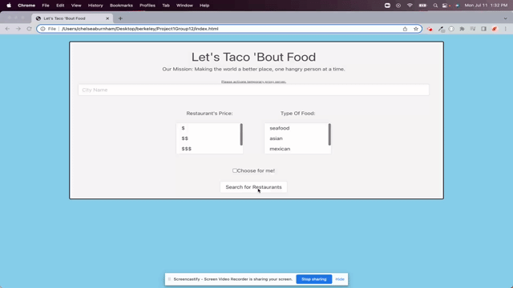

# Let's Taco 'Bout Food

 

<h3 align="center">Let's Taco 'Bout Food</h3>

  

    Browser-based tool for discovering new restaurants
     
  

  
Table of Contents

  <ol>
    <li>
      <a href="#about-the-project">About The Project</a>
      <ul>
        <li><a href="#tools-used">Tools used</a></li>
      </ul>
    </li>
    <li>
      <a href="#instructions">Instructions</a>
        </li>
    <li><a href="#Collaborators">Collaborators</a></li>
    <li><a href="#license">License</a></li>
    <li><a href="#contact">Contact</a></li>
  </ol>

## About The Project

(<a href="#top">back to top</a>)

### Tools used

* JavaScript
* CSS
* HTML
* [Bulma](https://bulma.io/)
* [Anime JS](https://animejs.com/documentation/)
* [jQuery](https://jquery.com/)

Bulma was used as the CSS framework for building the app layout. Javascript libaries used include Anime JS for the animation of the search container and jQuery for event handling as well as AJAX for API data retrieval. 

(<a href="#top">back to top</a>)

## Instructions

Once you have navagated to the webpage: 

- You are presented with search bar and restaurant filter for cost and food type.
- Once a day, you are required to enable the cors-anywhere.herokuapp.com/corsdemo proxy server to enable to Yelp API which is linked at the top of the page.
- If you enter a restaurant name, select your desired filters and submit the form using either the search button or the enter key, you are presented with a list of resturants that fill those filter criterion as well as a background image of that city. Information related to each restaurant include their ratings, phone number, address and link to the restaurant's Yelp page.
- You are able to resubmit new searches once a search is complete.

(<a href="#top">back to top</a>)

## License

Distributed under the MIT License. See `LICENSE.txt` for more information.

(<a href="#top">back to top</a>)

## Contact

[Henry Nguyen](hln11244@gmail.com) 

[Chelsea Burnham](chelseaburnham0@gmail.com)

[Sufyaan Vaidya](vaidyasufyaan@gmail.com)

[Deployed Link](https://henry11244.github.io/letsTacoBoutFood/)

